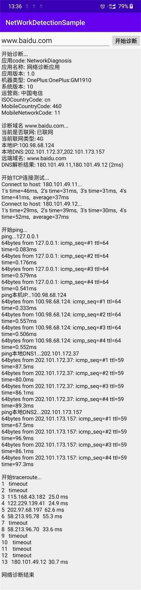

### NetWorkDetection

Android 网络诊断、网络检测库  
基于[AndroidHttpCapture](https://github.com/JZ-Darkal/AndroidHttpCapture)改造，剔除了不需要的功能，更精简。  
效果如图所示:  



### 添加依赖
#### Step 1. Add the JitPack repository to your build file
Add it in your root build.gradle at the end of repositories:

```java
allprojects {
	repositories {
		...
		maven { url 'https://jitpack.io' }
	}
}
```

#### Step 2. Add the dependency

```java
dependencies {
    implementation 'com.github.EthanCo:NetWorkDetection:1.0.2'
}
```

### 添加混淆

```java
-keep class com.netease.LDNetDiagnoService.**{*;}
```

感谢 [AndroidHttpCapture](https://github.com/JZ-Darkal/AndroidHttpCapture) | [LDNetDiagnoService](https://github.com/Lede-Inc/LDNetDiagnoService_Android)